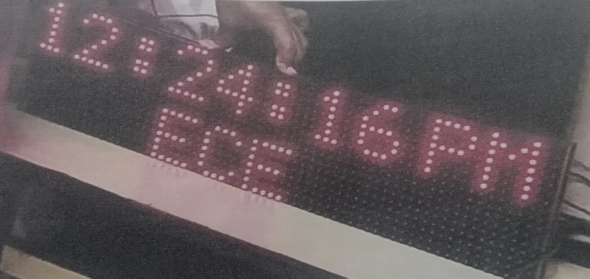

# ⏰ Digital Clock Display

## 📌 Project Overview
This project is a **Digital Clock Display** developed using **Arduino Uno**, **DS1307 RTC module**, and a **P10 LED display module**.  
The **DS1307 Real-Time Clock (RTC)** keeps accurate time, which is processed by Arduino Uno and displayed on the **P10 LED matrix**.  

This system continuously shows the current time in **HH:MM:SS** format, and can be used as a standalone digital clock for home, office, or educational purposes.

---

## 🛠️ Hardware Used
- Arduino Uno  
- DS1307 RTC Module  
- P10 LED Display Module  
- Jumper Wires  
- Power Supply  

---

## 💻 Working Principle
1. The **DS1307 RTC** keeps track of the current time even when the Arduino is powered off.  
2. Arduino Uno reads the time from DS1307 via **I2C communication**.  
3. The time is displayed on the **P10 LED module** in HH:MM:SS format.  
4. Optional: Additional LEDs can be used for AM/PM indication or other notifications.  

---

## 📷 Project Images

